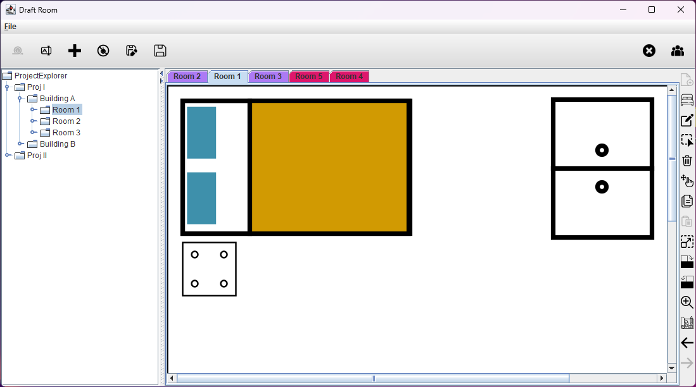
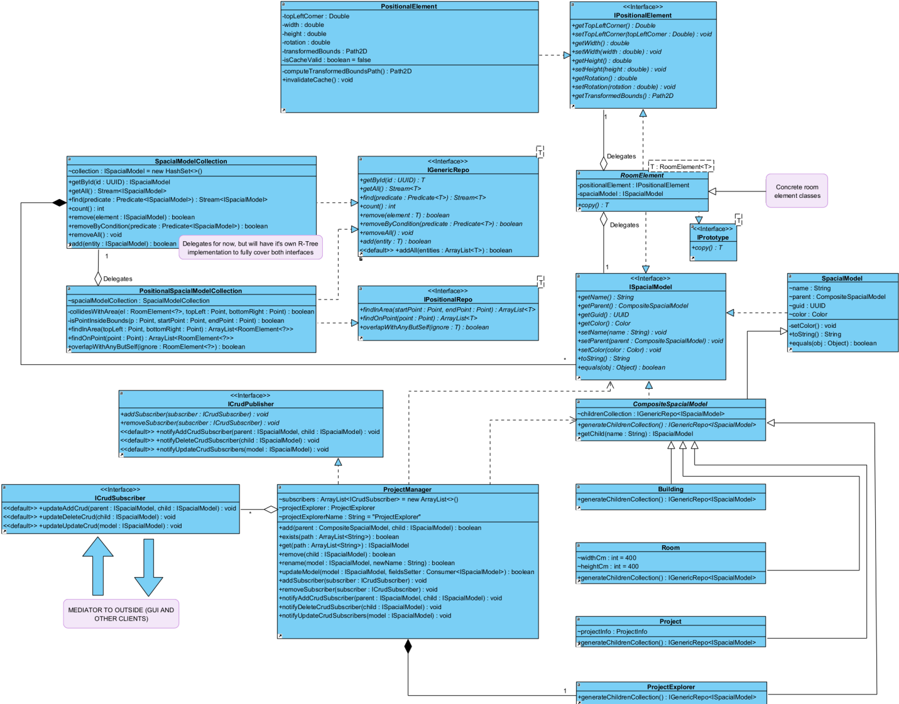

# IntiCAD
**A simple 2D room-planning tool for arranging furniture layouts**



<details>
<summary>Architecture</summary>

This project gave me hands-on experience implementing core OOP design patterns and SOLID principles in an MVC architecture, while collaborating with a team, using GitHub for source control, and meeting tight deadlines.

## Faculty baseline requirements (in Serbian)

```
src\main\resources\assignment\requirements
```
## UML example

This UML diagram highlights a clear separation of concerns between the UI and the core application, with the `ProjectManager` serving as the bridge between them.



</details>